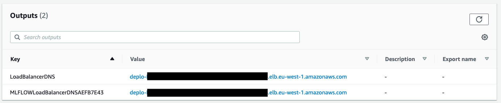

## Manage your machine learning lifecycle with MLflow and Amazon SageMaker

### Overview

In this repository we show how to deploy MLflow on AWS Fargate.

This implementation shows how to do the following:

* Host a serverless MLflow server on AWS Fargate with S3 as artifact store and RDS and backend stores

### MLflow tracking server
You can set a central MLflow tracking server during your ML project. By using this remote MLflow server, data scientists will be able to manage experiments and models in a collaborative manner.
An MLflow tracking server also has two components for storage: a ```backend store``` and an ```artifact store```. This implementation uses an Amazon S3 bucket as artifact store and an Amazon RDS instance for MySQL as backend store.

### Prerequisites

We will use [the AWS CDK](https://cdkworkshop.com/) to deploy the MLflow server.

To go through this example, make sure you have the following:
* An AWS account where the service will be deployed
* [AWS CDK installed and configured](https://docs.aws.amazon.com/cdk/latest/guide/getting_started.html). Make sure to have the credentials and permissions to deploy the stack into your account
* [Docker](https://www.docker.com) to build and push the MLflow container image to ECR

### Deploying the stack

Execute the following commands to install CDK and make sure you have the right dependencies:

```
npm install -g aws-cdk@2.51.1
python3 -m venv .venv
source .venv/bin/activate
pip3 install -r requirements.txt
```

Once this is installed, you can execute the following commands to deploy the inference service into your account:

```
cd setup
source .env
cdk bootstrap aws://${AWS_ACCOUNT_ID}/${AWS_DEFAULT_REGION}
cdk deploy --parameters ProjectName=mlflow --require-approval never
```

The stack will take a few minutes to launch the MLflow server on AWS Fargate, with an S3 bucket and a MySQL database on
RDS. You can then use the load balancer URI present in the stack outputs to access the MLflow UI:



